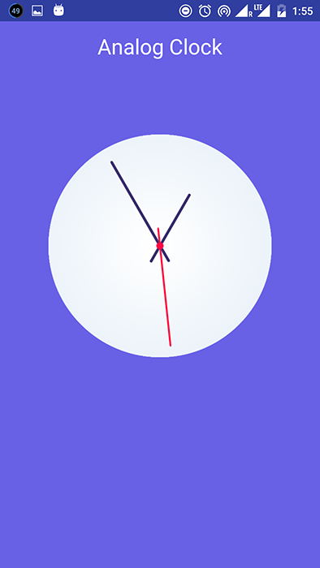

# Analog-Clock-View

[ ](https://bintray.com/libraryorg/maven/analog-clock-view/_latestVersion)

This is a custom view to show Analog Clock in android. It supports API 16+ versions.

Screenshots
-----------



## Add Dependencies
- Inside your build.gradle:
```xml
    compile 'com.imankur.library:analogclockview:1.0.0'
```
## Usage
- Inside your xml:
```xml
<com.imankur.analogclockview.AnalogClock
    android:layout_width="match_parent"
    android:layout_height="match_parent"/>
```

## Custom drawables 
- Inside your xml:
```xml
<com.imankur.analogclockview.AnalogClock
    android:layout_width="match_parent"
    android:layout_height="match_parent"
	app:showSecondHand="true"
	app:second="custom_drawable"
	app:dial="custom_drawable"
	app:hour="custom_drawable"
	app:minute="custom_drawable"
	app:second="custom_drawable"/>
```


## License
```
Copyright 2016 Ankur Jain

Licensed under the Apache License, Version 2.0 (the "License");
you may not use this file except in compliance with the License.
You may obtain a copy of the License at

   http://www.apache.org/licenses/LICENSE-2.0

Unless required by applicable law or agreed to in writing, software
distributed under the License is distributed on an "AS IS" BASIS,
WITHOUT WARRANTIES OR CONDITIONS OF ANY KIND, either express or implied.
See the License for the specific language governing permissions and
limitations under the License.
```
